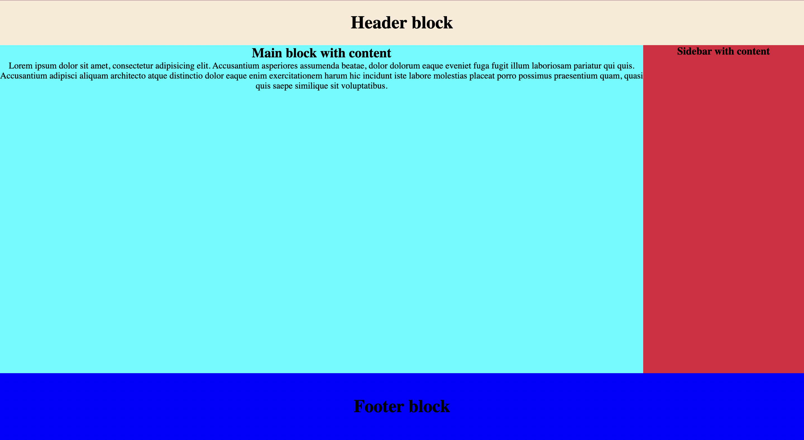

# Додатково 1

Потрібно реалізувати базовий макет сторінки

Деякі стилі вже є застосовані у style.css 

**Вимоги до виконання:**

1. Створити хедер блок за допомогою спеціального тегу header
   1. Надати йому висоту 80px, ширину 100% і колір на ваш вибір
   2. Добавити всередину тегу заголовок h1 - Header block
   3. Вирівняти текст посередині вертикально та горизонтально (використайте line-height)
2. Створити тег main з контентом всередині
   1. Добавити заголовок h2 - Main block with content
   2. Добавити будь-який текст під заголовком
   3. Висота блоку - потрібно виміряти за допомогою функції calc https://developer.mozilla.org/ru/docs/Web/CSS/calc() і використати одиниці виміру vh https://html5book.ru/edinicy-izmereniya-vh-vw-vmin-vmax/
   4. Ширина блоку - 80%, колір на ваш вибір
   5. Текст вирівняти по центрі горизонтально
3. Створити sidebar за допомогою тегу aside
   1. Висоту вимірюємо аналогічно до висоти main
   2. Ширина 20%, колір на ваш вибір
   3. Добавити заголовок h2 - Sidebar with content
   4. Текст вирівняти горизонтально
4. Добавити футер блок за допомогою тегу footer
   1. Висота блоку - 120px
   2. Ширина 100%
   3. Колір блоку добровільний
   4. Добавити текст Footer block і застилізувати його **СТИЛЯМИ** відповідно до картинки

**ВАЖЛИВО!**

Ваш макет не повинен перебільшувати висоту та ширину екрану, він повинен ідеально поміщатися під будь-який десктопний екран, для цього використовується функція calc у main i aside, висота header і footer стабільні